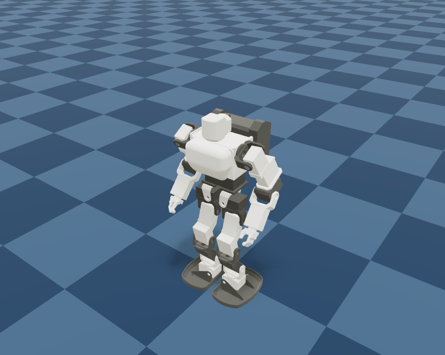

# KHRBan

KHR-3HVのMuJoCo/MjLabモデルと強化学習タスクです。`microban`とBAM原本は参照専用とし、KHR固有の変更はこのリポジトリ内で管理します。



画像はシミュレーション内のモデル表示例です。学習済み方策の性能や実機の動作を示すものではありません。

キーボードによるポリシー再生は、microbanと同じネイティブMuJoCo
`launch_passive`＋ビューワー内GLFWキーコールバック経路に固定します。
ブラウザ等へ置き換えない詳細規則は
[`docs/microban-runtime-contract.md`](docs/microban-runtime-contract.md)を参照してください。

ROS 2ワークスペースの `src` 直下に `KHRBan` と `microban` を並べて配置してください。BAM依存は再現性のため、確認に使ったRhoban/bamのcommitをGitHubから固定参照します。ローカルのmicroban原本は書き換えません。

この公開版は安定版 `main` のスナップショットです。個人環境の実行ログ、評価証拠、デスクトップショートカットは含みません。モデル・コードの動作確認には各自の環境で依存関係を導入してください。

## ライセンス

`KHR3_001_description/meshes/` 内のSTLメッシュは [CC BY-NC-SA 4.0](KHR3_001_description/meshes/LICENSE.md) で公開します。改変物の共有にも同じライセンス条件が適用されます。それ以外のKHRBan独自コード・URDF・文書・画像は [PolyForm Noncommercial License 1.0.0](LICENSE) で公開します。いずれも商用利用は許可せず、OSI定義の「オープンソース」には該当しません。権利者の表示は GitHub の `pukutai3`、X の `@RC_pukupukutaiy` です。権利者表示にメールアドレスは使いません。商用利用の個別許諾が必要な場合は、GitHubアカウントへ問い合わせてください。

STL以外の独自プログラムは、PolyFormの条件に従えば非商用目的でフォーク・改変・再配布できます。再配布時には[ライセンス本文のURLとRequired Notice](LICENSE)を残してください。Required Noticeには[元のKHRBan公開リポジトリ](https://github.com/pukutai3/KHRBan-public)を指定しています。GitHubでの表示だけに依存せず、配布物にもこの通知を含めてください。フォーク先の全コードを同一ライセンスにする義務を追加するものではありません。

過去にMITで公開したコミットに、この変更を遡及適用することはできません。以前のMIT許諾で受け取ったコードやメッシュの商用利用を、この変更だけで禁止するものではありません。第三者由来の素材・コードには同梱の [MIT表示](KHR3_001_description/LICENSE) と [Apache-2.0表示](KHR3_001_description/viewer/THIRD_PARTY_LICENSE.txt) が別途適用されます。

## 推奨する学習順序

KHRBanの主学習課題は、次の順に進めます。

1. **速度追従歩行** — 前後・左右の移動と旋回の指令に追従する歩行方策を学習し、評価基準を達成する。
2. **単独の起き上がり** — 歩行を含めず、転倒状態から立ち上がる動作を独立した方策として学習・評価する。
3. **歩行と転倒回復の統合** — 歩行と単独の起き上がりをそれぞれ確認した後、歩行中の転倒検知から起き上がり、歩行再開までを一つの方策で扱う。

主課題の速度追従歩行に加え、単独の起き上がりタスク・姿勢別評価・速度追従合格後の自動学習導線を用意しています。起き上がりはGPUスモークと実学習が未確認の候補であり、速度追従の合格前には開始できません。歩行と転倒回復の統合課題は未実装です。静止バランスは姿勢・学習経路の基礎確認に使える補助タスクで、上記の主学習順序には含めません。起き上がりの開始姿勢と評価仕様は[`docs/getup-training.md`](docs/getup-training.md)を参照してください。

## 静止バランス基準タスク（補助）

確認済みHTH4ホーム姿勢を平地で維持する静止バランスを学習する補助タスクです。速度追従歩行を始める前のモデル・学習経路の確認や、独立した姿勢安定性の調査に使用できます。

- 物理周期: 200 Hz (`timestep=0.005`)
- 方策周期: 50 Hz (`decimation=4`)
- 行動: 22関節のホーム姿勢からの位置オフセット（最大 `±0.25 rad`）
- 観測: 基底速度・重力方向・関節位置／速度・前回行動・左右脚の屈伸率
- 終了: 10秒経過、または胴体傾斜45度超過
- ログ: TensorBoard（外部アカウント不要）

屈伸率はサーボ指令値ではありません。腿ピッチ軸から膝ピッチ軸への
リンクAと、膝ピッチ軸から足首ピッチ軸へのリンクBを現在のモデル姿勢
から作り、両リンクのなす角を 0..1（0°..180°）へ正規化した観測値
です。TensorBoardでは左右の角度を
left_leg_flexion_deg / right_leg_flexion_deg として度数表示します。

microbanとの関節間距離、および寸法依存する学習評価の監査結果は
[`docs/model-dimension-reward-audit.md`](docs/model-dimension-reward-audit.md)
に記録しています。現在の静止学習は寸法補正不要ですが、microbanの
歩行用距離・高さ閾値はKHRへそのまま転用しません。

```bash
cd <your-ros2-workspace>/src/KHRBan
uv sync
uv run khrban-train --task standing --num-envs 1024 --iterations 2000
```

短い配線確認は次で実行します。

```bash
uv run khrban-train --task standing --num-envs 16 --iterations 1 --run-name smoke
```

## 第1段階：平地速度追従歩行

KHR固有の足寸法とサンプルモーション範囲を使う速度追従タスクです。
腰ヨー、頭ヨー、左右肘ヨーは
ホーム位置に保持し、残る18関節を方策が制御します。

```bash
uv run khrban-train --task velocity --num-envs 1536 --iterations 15000
```

候補の短時間確認は次で実行します。

```bash
uv run khrban-train --task velocity --num-envs 16 --iterations 1 \
  --run-name velocity-smoke
```

PPOが実際に更新している学習環境のうち16体を日本語GUIへ表示する場合は、
学習自体をライブ表示付きで起動します。単独の `khrban-train` では
同じプロセス、`khrban-auto-train` では長寿命の監督プロセスが
ビューアを保持し、学習子プロセスの `env.step()` 直後の姿勢だけを
ローカルIPCで送ります。別のpolicy再生環境ではありません。

```bash
uv run khrban-train --task velocity --num-envs 1536 --iterations 15000 \
  --live-viewer --viewer-num-envs 16
```

保存済みチェックポイントを別環境で再生するだけの場合は次のように起動します。

```bash
uv run khrban-play Mjlab-KHR-Velocity-Training-View \
  --checkpoint-file logs/rsl_rl/khr_velocity/<run>/model_<iteration>.pt \
  --num-envs 16 --viewer viser
```

microban本体と同じキー操作で、最新のKHR速度ポリシーをネイティブMuJoCo
1体へ再生できます。学習とは別のCPUプロセスなので、GPU学習と8080番の
ライブ表示を継続したまま起動できます。

```bash
uv run khrban-keyboard-policy --device cpu
```

- `V`: 学習ポリシーの有効/無効
- `↑` / `↓`: 前進/後進の正規化指令を0.1ずつ変更
- `←` / `→`: 左/右旋回の正規化指令を0.1ずつ変更
- `X`: 速度指令をゼロ
- `R`: 初期姿勢へリセット
- `Q`: 再生を終了

microbanと同様、前進上限0.7 m/s、後進上限0.5 m/s、移動中旋回上限
1.5 rad/s、停止旋回上限3.0 rad/sへ正規化指令を変換します。起動直後は
ポリシー無効なので、MuJoCoウィンドウを選択して`V`を押します。

Windowsでは `tools/windows/KHRBan-GUI.ps1` の「実学習ビューア」ボタンが、
16環境の可視化用PPO学習を開始して表示します。「速度追従歩行」は1024環境を
学習し、そのうち先頭16環境を同じライブ表示へ送ります。既に8080番ポートで
ライブ表示中なら、その画面を再利用します。

公開版のControl Deskを起動する前に、`KHRBAN_LINUX_REPO` にWSL内のKHRBanの
絶対パス、`KHRBAN_MOTION_PROJECT` にHTH4モーションのパスを設定してください。
ショートカットは各自の環境で作成します。Control Deskには、独立した
「速度追従歩行」「起き上がり開始」「モーション確認」「キーボード操作」があります。学習は
GPU・8080、モーション確認はCPU・8081、キーボード操作はCPU・ネイティブ
MuJoCo 1体を使う別プロセスとして同時実行できます。
起き上がりボタンは速度追従の合格評価とチェックポイントを確認し、未達の場合は開始を拒否します。
学習とモーション確認には専用の停止ボタンがあり、キーボード操作は`Q`で
終了します。一方を停止しても他方は継続します。
Control Deskを閉じても、起動済みの学習、モーション確認、ポリシー再生は
終了しません。
CPUモーション確認の初回起動では物理カーネルのキャッシュ生成に時間が
かかる場合があります。

## 達成までの自動学習

`khrban-auto-train`は既存の最新モデルを最初に評価し、未達の場合だけ
速度追従PPOを2000反復ずつ追加します。各ラウンドの最終モデルを
別プロセスの64環境・500ステップで評価し、次の条件を
すべて満たすまで最新モデルから追加学習を続けます。ラウンド数の上限は
ありません。学習・評価の子処理が異常終了した場合も、30秒から最大300秒の
指数バックオフで再試行します。
評価は学習seed 42とは分離した固定seed 314159を使い、各ラウンドを同条件で
比較します。

すべての小数評価値は、表示している目標と同じ小数第2位へ
ROUND_HALF_UPで丸めてから合否判定とcheckpoint順位付けを行います。
例えば`0.1044`は`0.10`として合格、`0.1073`は`0.11`として不合格です。
端末と自動学習ログもこの判定値を必ず2桁で表示します。
評価履歴には生値に加えて、実際に判定へ使った`comparison_values`を保存しますが、
生値は監査用であり表示や合否には使いません。

未達checkpointの再開元は、次の段階評価で選びます。

1. **安全確認** — サンプル成立、転倒、停止中の接地、action範囲を優先する。
2. **速度追従** — 安全条件を維持し、前後左右速度と旋回のRMSEを優先する。
   この段階では足上げの一時的な低下だけを理由に速度改善候補を捨てない。
3. **歩容形成** — 速度追従条件を合格したcheckpointだけを対象に、左右の足上げ
   成功率を改善する。
4. **最終統合** — 下記の全条件を同時に満たした場合だけ学習完了とする。

段階は途中の再開checkpoint選択にだけ使用し、最終合格条件は緩和しません。
各新規評価の到達段階は`auto_training_evaluations.jsonl`の
`evaluation_stage`へ保存します。

- 10秒間に一度でも転倒した環境の割合: 5%以下
- 前後・左右速度のRMSE: 0.10 m/s以下
- 前・後・左・右を各1sample以上含み、4方向で最も悪い軸速度RMSE: 0.15 m/s以下
- ヨー角速度のRMSE: 0.28 rad/s以下
- 純旋回中の転倒率: 5%以下
- 純旋回のヨー角速度RMSE: 0.31 rad/s以下
- 純旋回中の直線ドリフトRMSE: 0.08 m/s以下
- 足裏接地から着地を検出し、遊脚高さ21 mmかつ滞空時間0.125〜0.30秒を
  同時に満たす着地: 左右それぞれ50%以上（左右とも1回以上の着地が必要）
- 停止指令を1sample以上含み、停止中に足裏が非接地となる割合: 5%以下
- KHR安全clipの外側となるraw policy actionの割合: 5%以下

速度・旋回の既定閾値は、pinned Microban配布ポリシーを同じ評価指標・条件で実測し、
有限サンプルとGPU再現性の余裕を加えて校正しています。基準値の根拠と比較結果は
評価閾値は同梱の評価コードで確認できます。内部の実行証拠は公開版に含めません。
左右別の足上げとKHR安全clipは、MicrobanにないKHR固有の追加合格条件です。

```bash
uv run khrban-auto-train --num-envs 1536 --iterations-per-round 2000 \
  --live-viewer --viewer-num-envs 16 --keep-checkpoints 3
```

既定では既存の最新チェックポイントから再開し、モデルファイルはリポジトリ内の
全速度学習runを通して更新時刻が新しい3件だけ残します。評価した再開元は次ラウンドが
開始できるよう必ず保持します。中間保存間隔も1ラウンド
と同じ2000反復に広げ、評価前の一時的な蓄積を抑えます。TensorBoardログ、設定、
各ラウンドの`evaluation.json`、および
`logs/rsl_rl/khr_velocity/auto_training_evaluations.jsonl`の評価履歴は削除しません。

自動学習はワークスペース単位の排他ロックを取得するため、GUIと端末の
どちらから起動しても同時に2本は実行されません。学習または評価の子処理が
異常終了した場合は30秒から最大300秒までの指数バックオフで再試行し、
設定した評価条件を達成するまで監督処理を継続します。
ライブビューアは自動学習の開始から終了まで同一8080番サーバーを保持し、
評価・保存・ラウンド切替中は動きを捏造せず、最後の実学習フレームと
現在の状態表示を保持します。
完全に新規学習する場合だけ`--fresh`を指定します。評価条件、評価環境数、保持数は
各CLIオプションで変更できます。

## 第2段階：単独の起き上がり

起き上がり方策は歩行方策と別に学習します。速度追従自動評価の合格記録と、
その評価で保護されたチェックポイントが確認できた後にのみ開始できます。
Control Deskの「起き上がり開始」ボタンを使うか、次のコマンドを実行します。

```bash
uv run khrban-auto-train-getup --num-envs 1024 --iterations-per-round 2000 \
  --eval-num-envs 256 --eval-num-steps 500 --live-viewer \
  --viewer-num-envs 16 --viewer-port 8080 --keep-checkpoints 3
```

顔を床へ向けた姿勢、背中を床へ向けた姿勢、左右側面の4種類を均等に開始し、
クラスごとに評価します。各クラスで80%以上が胴体高さ270 mm以上・傾き20°以内・
両足接地の状態を最後の1秒間維持するまで、2,000反復ずつ無制限に追加学習します。
起き上がりも速度追従と同じ排他ロックを使い、GPU学習を同時起動しません。
実学習中ビューアは速度追従と同じ学習環境表示経路で16体を表示します。
詳細な開始姿勢の寸法・評価定義・検証境界は
[`docs/getup-training.md`](docs/getup-training.md)を参照してください。

参照する`mjlab_microban`には外部の合否判定器はありません。KHRBanでは、
microbanの観測・報酬・外乱・カリキュラム・PPOの非モデル設定を固定commit
`d594a6088bb7b6600fe8098321169031fbca680c`へ合わせ、その学習目標を上記の
自動評価器で検査します。KHR独自値として残すのは、URDF、KRS-2552、関節対応、
action scale、足寸法、原点姿勢、転倒条件などの機体依存部分です。
KHR固有のaction安全clipが作る平坦領域については、clipを超えたraw action量の
二乗和だけに`-0.04`の報酬を加え、clip内の有効actionは罰しません。
clip外action率も自動評価します。
Microbanと同じ最小滞空時間0.125秒を学習報酬と評価で使います。
また、移動指令中に足の滞空が評価上限0.30秒を超えた場合は、
1足ごとに`-3.0`で罰します。通常の0.125〜0.30秒のair-time加点と
停止指令は変更しません。
