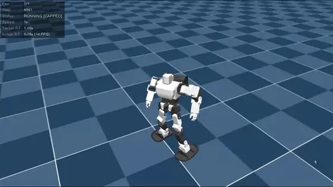
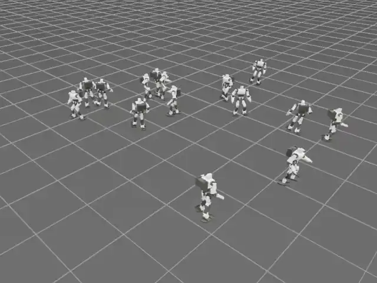

# KHRBan

KHR-3HV（22軸）をMuJoCo/MjLabで再現し、前後・左右移動と旋回を強化学習するプロジェクトです。URDF、KRS-2552向けアクチュエータ設定、関節対応をKHR用に用意し、学習方式はmicrobanを参照しています。

[使い始める](#使い始める) · [学習を開始する](#速度追従歩行を学習する) · [動作例を見る](#動作例) · [詳しい操作と評価](docs/training-and-evaluation.md) · [ライセンス](#ライセンス)


*モデルのシミュレーション表示例。学習の達成や実機性能を示す画像ではありません。*

## できること・現在地

| 項目 | 公開版の状態 |
| --- | --- |
| KHR-3HVモデル | 22軸のURDF・メッシュ、KRS-2552向けアクチュエータ設定を収録 |
| 速度追従歩行 | 前後・左右移動と旋回の学習、自動評価、未達時の追加学習を実装 |
| 学習中の表示 | 実際の学習環境から選んだ16体をライブビューアに表示 |
| 単独の起き上がり | 学習・姿勢別評価の経路を用意。GPUスモークと実学習は未確認 |
| 歩行と転倒回復の統合 | 未実装 |

> **公開版の検証範囲:** 学習済みチェックポイント、実行ログ、評価証拠は同梱していません。「実装」は目標達成の実証を意味しません。評価条件は[学習・操作・評価ガイド](docs/training-and-evaluation.md)を参照してください。

## 使い始める

Python 3.12と`uv`を用意し、WSL上のROS 2ワークスペースの`src`に`KHRBan`として配置します。`/path/to/ros2_ws`は自分のワークスペースのパスに置き換えてください。

```bash
cd /path/to/ros2_ws/src
git clone https://github.com/pukutai3/KHRBan-public.git KHRBan
cd KHRBan
uv sync
```

`microban`を隣に置く場合も、参照用の原本は変更しません。BAM依存は`pyproject.toml`で固定commitを参照します。

最初に学習経路を1反復だけ確認できます。GPUなど実行環境の準備と本学習の手順は[詳細ガイド](docs/training-and-evaluation.md)を参照してください。

```bash
uv run khrban-train --task velocity --num-envs 16 --iterations 1 \
  --run-name velocity-smoke
```

## 速度追従歩行を学習する

自動学習は評価 → 未達なら追加学習 → 再評価を繰り返します。全条件に合格するまでラウンド数の上限は設けません。下のコマンドでは、学習環境のうち16体をライブ表示します。

```bash
uv run khrban-auto-train --num-envs 1536 --iterations-per-round 2000 \
  --live-viewer --viewer-num-envs 16 --keep-checkpoints 3
```

実行前に[評価条件とチェックポイント保持](docs/training-and-evaluation.md#達成までの自動学習)を確認してください。起き上がりは、歩行の合格記録と保護されたチェックポイントが揃うまで開始できません。

学習の順序: **速度追従歩行 → 単独の起き上がり → 歩行と転倒回復の統合**（最後の統合は未実装）

## 動作例

どちらも提供された動画をループするアニメーションに変換した、シミュレーションの表示例です。方策の評価結果や実機性能は示していません。動きを確認したいときに開けます。

<details>
<summary>単体モデルの動作を見る（約79秒）</summary>



</details>

<details>
<summary>同一ワールド内の複数モデルを見る（約178秒）</summary>



</details>

## 操作・資料

- [学習・操作・評価ガイド](docs/training-and-evaluation.md) — 静止バランス、歩行、キーボード再生、Windows Control Desk、評価閾値、起き上がりのコマンドと条件
- [起き上がりの設計・検証境界](docs/getup-training.md) — 姿勢別評価と未確認事項
- [モデル寸法と報酬の監査](docs/model-dimension-reward-audit.md) — microbanとの関節間距離とKHR固有の閾値
- [microban起動経路の規約](docs/microban-runtime-contract.md) — ネイティブMuJoCoのキーボード再生を維持するルール

WindowsのControl Deskは`tools/windows/KHRBan-GUI.ps1`です。起動前に次を設定してください。

- `KHRBAN_LINUX_REPO`: WSL内のKHRBan絶対パス
- `KHRBAN_MOTION_PROJECT`: モーション確認を使う場合のHTH4モーションのパス

ショートカットは各自の環境で作成します。

## ライセンス

| 対象 | 条件 |
| --- | --- |
| `KHR3_001_description/meshes/*.stl` | [CC BY-NC-SA 4.0](KHR3_001_description/meshes/LICENSE.md) |
| その他のKHRBan独自コード・URDF・文書・画像 | [PolyForm Noncommercial 1.0.0](LICENSE) |
| 第三者由来の素材・コード | 同梱の[MIT表示](KHR3_001_description/LICENSE)または[Apache-2.0表示](KHR3_001_description/viewer/THIRD_PARTY_LICENSE.txt) |

独自プログラムはPolyFormの条件に従い、非商用目的でフォーク・改変・再配布できます。配布時は次を守ってください。

- [ライセンスとRequired Notice](LICENSE)を残す
- 元リポジトリ `https://github.com/pukutai3/KHRBan-public` を明記する

権利者表示はGitHubの`pukutai3`とXの`@RC_pukupukutaiy`を使用し、メールアドレスは掲載しません。商用利用の個別許諾はGitHubアカウントへお問い合わせください。

これらは非商用条件を含むため、OSI定義のオープンソースではありません。過去にMITで公開した版への許諾は遡及して取り消せず、その版の商用利用を今回の変更だけで禁止することはできません。
